## 1. zadání
Zhruba před rokem naši školu oslovil klient Nadace jedličkova ústavu  s žádostí o vytvoření kampaně pro 30 výročí. Přesněji vizuální styl s námětem   krátkého video spotu do TV.

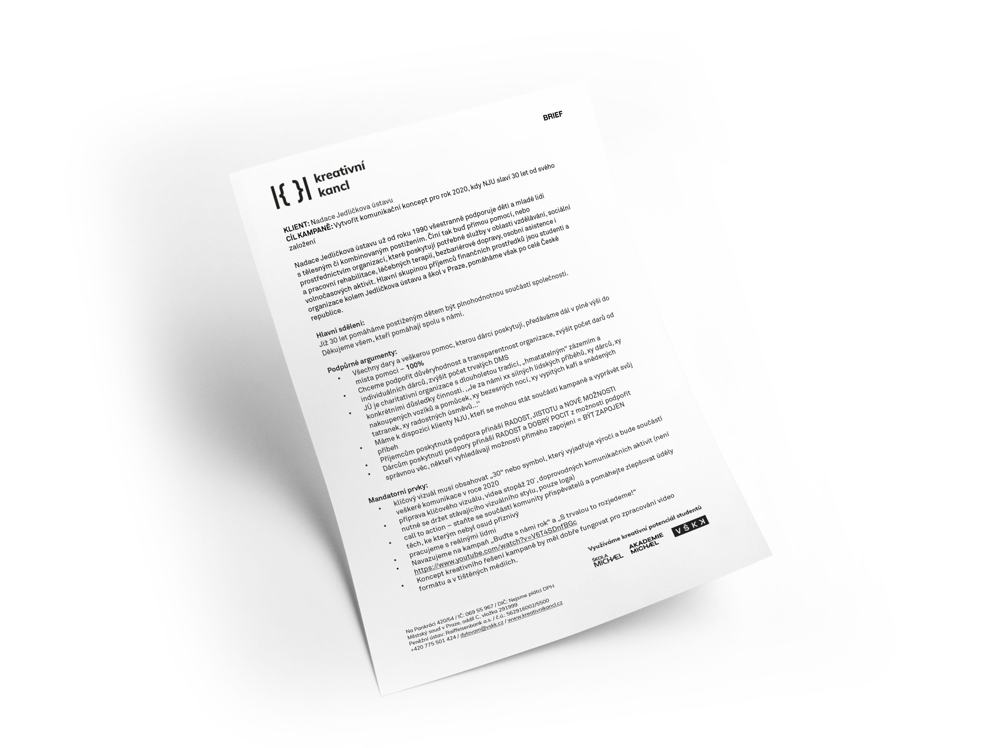 `brief`

>## *Klient

>*Nadace Jedličkova ústavu už od roku 1990 podporuje děti a mladé lidi
>s tělesným či kombinovaným postižením. Hlavní skupinou příjemců finančních prostředků jsou studenti a organizace kolem Jedličkova ústavu a škol v Praze, pomáháme >však po celé České republice.

 [Nadace jedličkova ústavu](https://nadaceju.cz) I [Instragram](https://www.instagram.com/nadaceju/) I [Facebook](https://www.facebook.com/nadaceju)
 
 

## 2.	Rešerše
První fází našich příprav bylo seznámení se s prostředím nadace zabývající postižením i světem s tím spojeným. Velkým přínosem byla námi organizovaná společná setká s vedením nadace, a hlavně s jejich klienty. Navázáním vzájemné důvěry a vyslechnutí příběhů jsme získali cenné informace pro přípravu takové kampaně, která naplní veškerá očekávání klienta. 

  `first ideas`

#### Body vzešlé z rešerší:

- Klient nekomunikuje skrze reálné osoby, ale využívá animaci.
- Klient komunikuje v předchozích kampaních smutně až soucitně.
- Chceme vytvořit příběh.
- Chceme používat reálných osob a klientů nadace.
- Chceme být veselí.
-	Chceme využívat reálné příběhy postižených lidí.
-	Chceme pochopit potřeby klienta i postižených lidí
 

## 3. Kampaň s názvem zelený kolíček
Proč zelený kolíček?
Zelený kolíček se stal symbolem nejen kampaně, ale celé nadace. Kolíček je inspirovaný skutečným příběhem stávajícího klienta Jakuba. Sami se můžete podívat na náš společný rozhovor, ve kterém naleznete všechny důležité odpovědi.

>#### Play Interview
>[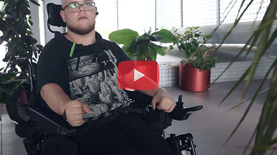](https://www.youtube.com/watch?v=5RJ_7pBZ2uE&t "interview")

Jak už bylo zmíněno. Zdravý lidé mají potíže s konfrontací s postiženými lidmi.
A právě ti, ke kterým je směřována naše podpora, jsou naší největší motivací k práci. Proto jsme se rozhodli v nové kampani Zelený kolíček upozornit na to, že společnost nemusí být rozdělená na lidi zdravé a na lidi s postižením. Nikdo se nemusí být udělat první krok. Naše kampaň zelený kolíček podporuje motto Kolíček nás spojuje a nikdo se nemusí být udělat první krok k tomu, aby pomáhal.

Pojďme vzájemně respektovat naše schopnosti, pojďme pomáhat budovat nové možnosti a pojďme být jednou společností.
 

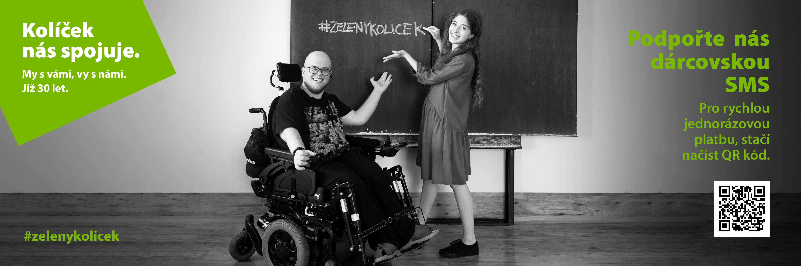 `#zelenykolicek` `#koliceknasspojuje` `#nadaceju` `#jsijedenznas`
 
 

## 4.	zakončení
Nejen že jsme splnili klientovo zadání, ale vytvořili jsme něco mnohem silnějšího. Něco, co dokáže opravdu spojovat svět zdravých a svět postižených. Dali jsme klientovi symbol v podobě zeleného kolíčku, který bude v dalších letech reprezentovat Nadaci jedličkova ústavu. Klient může své další roky stavět na produktu, který má historii a příběh. Vytvořili jsme den zeleného kolíčku. A jednoho dne bude tento den znát většina obyvatel v České republice. Od 4.11. můžete vidět vizuální styl v plné kráse včetně televizního spotu. Už se ani vy nemusíte bát udělat první krok a pomáhat zakoupením zeleného kolíčku. 

>####  TV spot
>[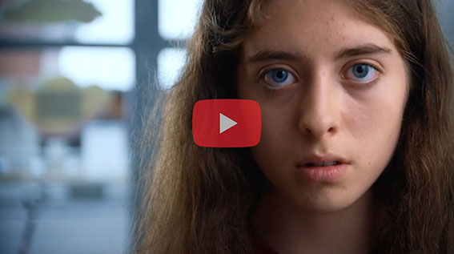](http://www.youtube.com/watch?v=-Zy0uLBJQ4w "TV_spot")
 

## *Poděkování
*Mé vřelé poděkování za bezvadnou spolupráci bych rád předal  svým dvěma spolužákům. Týna Janoušová a Honza Rákosník byli nedílnou  součásti celého projektu. A díky nim to byla parádní jízda.

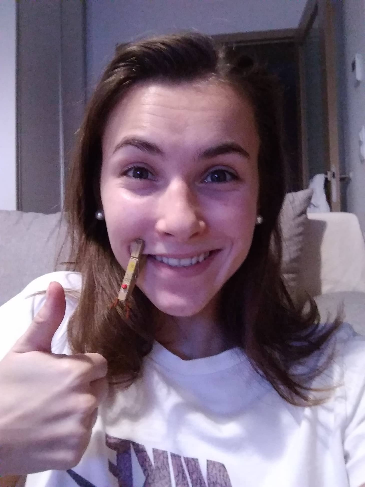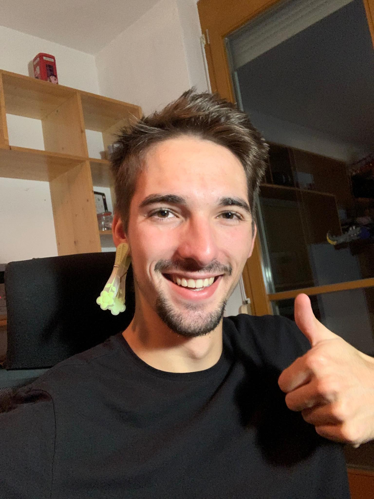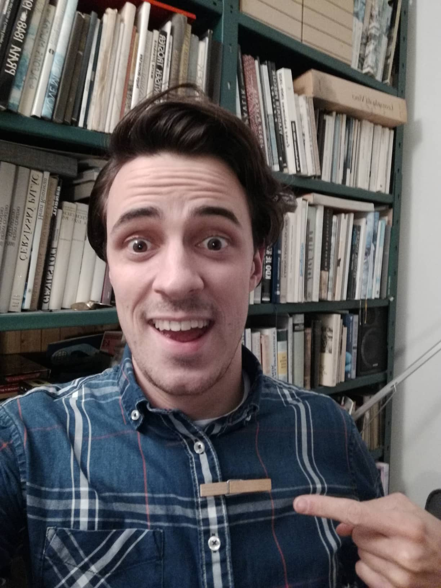

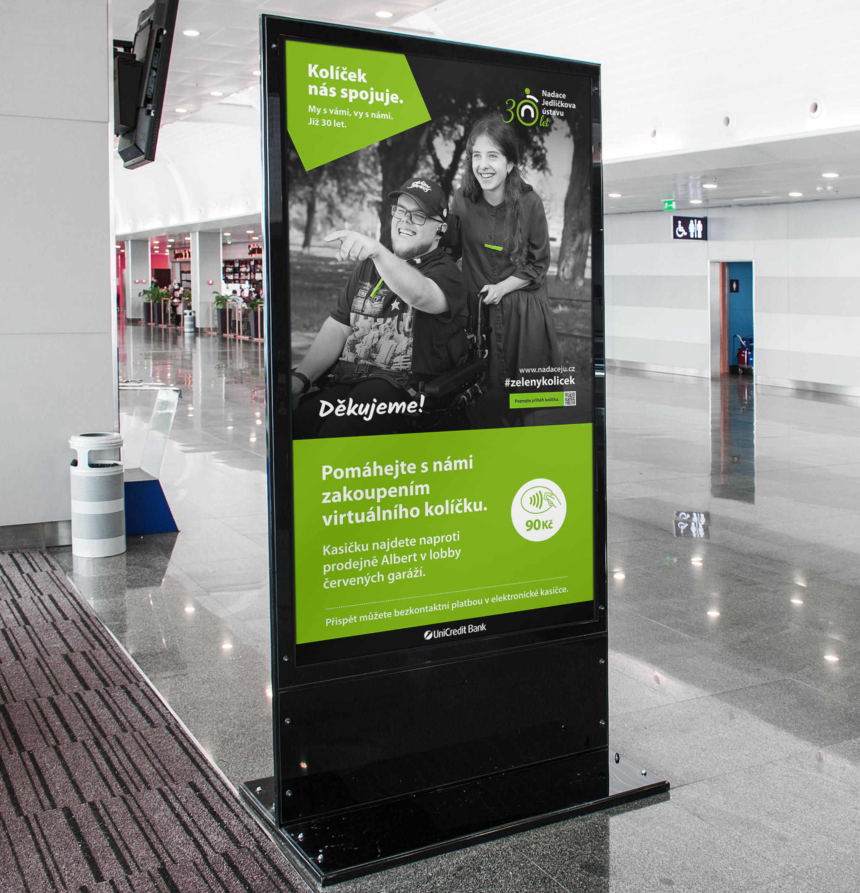
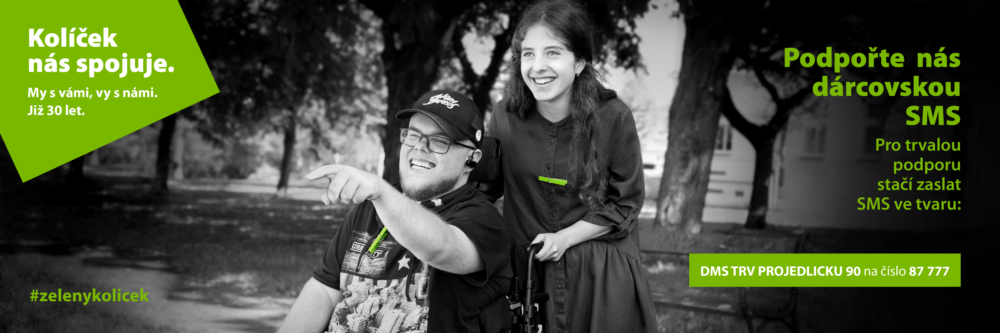

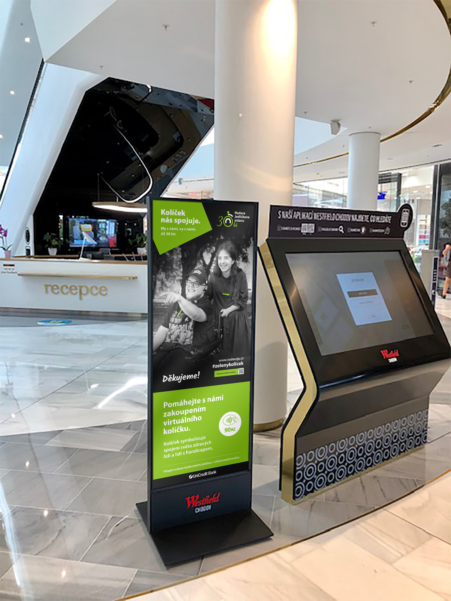

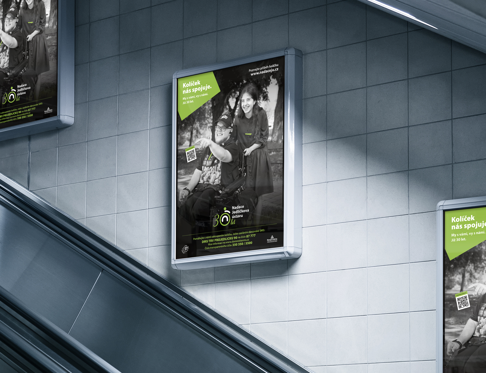
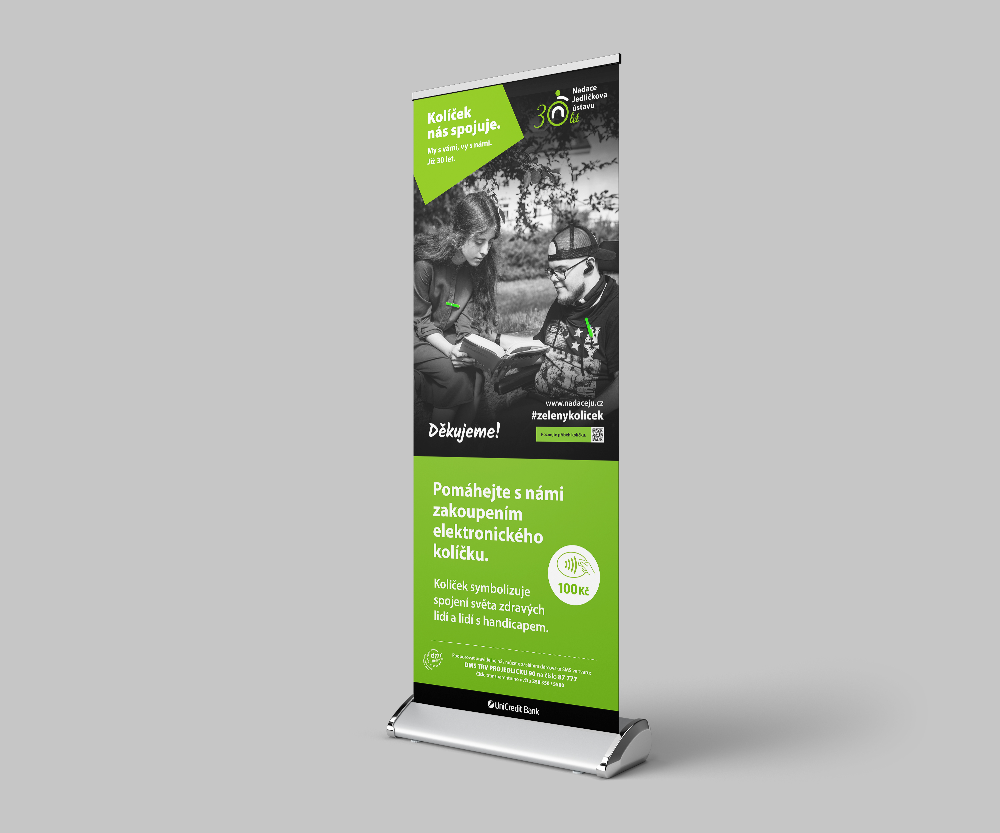

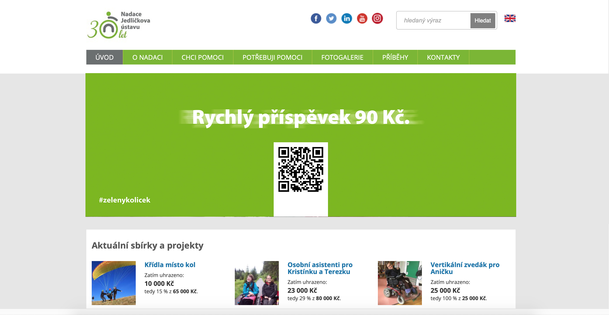

