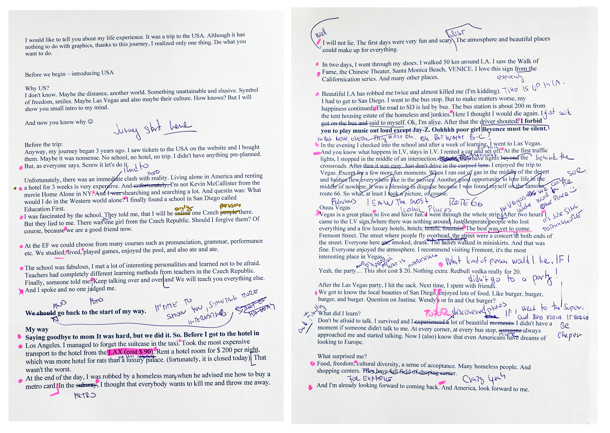

### Structure

- Introduction (Who Am I?)
- Trip to USA
  - What is the USA?
  - Why America?
  
- Before the Trip
  - Ticket
  - School
  - Do not be afraid
  
- Discover My Way & Interesting Places
  - Say goodbye to my mom
  - Crazy moments & First days
  - Transport to San Diego
  - Las Vegas
  - Food
  
- What Did I Learn?
- What Surprised Me?
- The End

### Presentation for viewing
[My presentation -here-](https://github.com/dudacek/english_for_designers/blob/main/05-presentation-stoytelling/jakub-dudacek-presentation-usa.pdf)

My Notes for Presentation
 

### Presentation text
I would like to tell you about my life experience. It was a trip to the USA. Although it has nothing to do with graphics, thanks to this journey, I realized only one thing. Do what you want to do.

#### Before we begin – introducing the USA

#### Why the US? 
I don't know. Maybe the distance, another world. Something unattainable and elusive. Symbol of freedom, smiles. Maybe Las Vegas and also maybe their culture. How knows? But I will show you a small intro to my mind.

And now you know why.

#### Before the Trip:
Anyway, my journey began three years ago. I saw tickets to the USA on the website. I bought them. Maybe it was nonsense. No school, no hotel, no trip. I didn't have anything pre-planned.
But, as everyone says. Screw it let's do it.

Unfortunately, there was an immediate clash with reality. Living alone in America and renting a hotel for three weeks is very expensive. I'm not Kevin McCallister from the movie Home Alone in NY. I had to search and search a lot. And the question was: What would I do in the Western world alone? I finally found a school in San Diego called Education First.
I was fascinated by the school. They told me, that I will be only one Czech person there.
But they lied to me. There was one girl from the Czech Republic. Should I forgive them? Of course, because we are a good friend now.

At Education First, we could choose from many courses such as pronunciation, grammar, performance, etc. We studied, lived, played games, enjoyed the pool, and also ate and ate.

The school was fabulous. I met a lot of interesting personalities and learned not to be afraid. Teachers had completely different learning methods from teachers in the Czech Republic. Finally, someone told me: Keep talking over and over. We will teach you everything else. And I spoke and no one judged me. 

It is time to show you something more interesting.
We should go back to the start of my way.

#### Discover My Way
Saying goodbye to mom It was hard, but we did it. So. Before I got to the hotel in Los Angeles. I managed to forget the suitcase in the taxi. Took the most expensive transport to the hotel from the LAX (cost $ 90). Rent a hotel room for $ 200 per night, which was more hotel for rats than a luxury palace. (fortunately, it is closed today). That wasn't the worst.
At the end of the day, I was robbed by a homeless man when he advised me how to buy a metro card. In the metro (subway), I thought that everybody wants to kill me and throw me away. 

(Well) I will not lie. The first days were very fun and scary. (Just) The atmosphere and beautiful places could make up for everything.

In two days, I went through my shoes. I walked 50 km around LA. I saw the Walk of Fame, the Chinese Theater, Santa Monica Beach, VENICE. I love this sign from the Californication series. 

Beautiful LA has robbed me twice and almost killed me (I'm kidding). 
I had to get to San Diego. I went to the bus stop. But to make matters worse, my happiness continued. The road to SD is led by bus. The bus station is about 200 m from the tent housing estate of the homeless and junkies. Here I thought I would die again. I just said to myself. I'm alive on the bus, everything will be OK. After that, the driver shouted. I forbid you to play music out loud except Jay-Z. Oohhhh poor girl Beyonce must be silent.

In the evening I checked into the school and after a week of learning, I went to Las Vegas. And you know what happens in LV, stays in LV. I rented a car and set off. At the first traffic lights, I stopped in the middle of an intersection. Behold, they have lights beyond the crossroads. After then it was easy. Just don't drive in the carpool lane. I enjoyed the trip to Vegas. Except for a few more fun moments. When I ran out of gas in the middle of the desert and bushes flew everywhere like in the movies. Another good opportunity to lose life in the middle of nowhere. It was a blessing in disguise because I was found myself on the famous route 66. So what, at least I took a picture, of course.

#### Vegas
Vegas is a great place to live and have fun. I went through the whole strip. In Vegas, we can see the whole world in one place. After two hours I came to the LV sign, where there was nothing around. Just desperate people who lost everything and a few luxury hotels, hotels, hotels, fountain. The best was yet to come. Fremont Street. The street where people fly overhead, the street were a concert at both ends of the street. Everyone here ate, smoked, drank. The ladies walked in miniskirts. And that was fine. Everyone enjoyed the atmosphere. I recommend visiting Fremont street.  It is the most interesting place in Vegas. 

What kind of person would I be, If I did not go to a party.
*(Yeah, the party… This shot cost $ 20. Nothing extra: Redbull & Vodka.)*

After the Las Vegas party, I hit the sack. Next time, I spent it with friends.
We got to know the local beauties of San Diego, enjoyed lots of food. Like burger, burger, burger, and burger. Question on Justina: Wendy's or In and Out burger?

#### What Did I Learn? 
Don't be afraid to talk. I survived and discovered a lot of beautiful places. I didn't have a moment if someone didn't talk to me. At every corner, at every bus stop, people always approached me and started talking. Now I (also) know that even Americans have dreams of looking to Europe.

#### What Surprised Me?
Food, freedom, cultural diversity, a sense of acceptance. Many homeless people. And shopping centers. 

And I'm already looking forward to coming back. And America, look forward to me.

