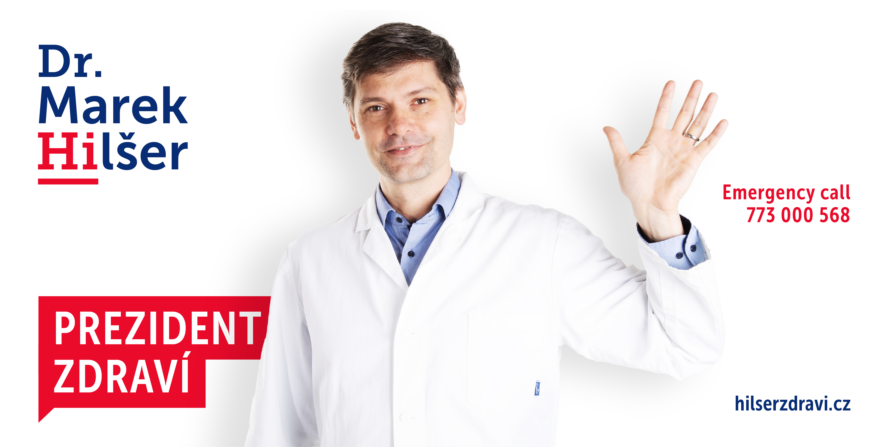
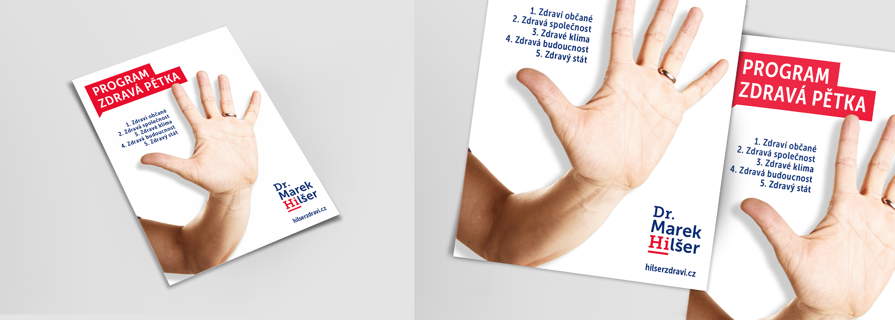

<!-- Add an *optional* hero image to provide visual context. -->

# Marketing and visual communication of a presidential campaign for Mark Hilšer

<!-- Content goes here… -->

## Abstract Draft

The bachelor's thesis deals with the visual identity of a presidential campaign for
Marek Hilšer in the year 2023. It is based on a general public survey, questioning of 
the target audience, and a probe into the current environment which establishes grounds to find appropriate presidential positioning. The thesis delivers a complex solution in the form of consistent marketing and visual communication. It presents graphic designs, including voice and tone, and a strategic plan for working with new media. In its conclusion, the thesis approves the advantages of visual identity, which helps build a memorable image of 
Marek Hilšer.

## Keywords

`elections` `political marketing` `political management` `Marek Hilšer` 
`contact campaign` `election campaign` `presidential elections`
`brand essence` `visual style` `digital media` `slogans`

## Article

In the campaign, I tried to present Marek Hilšer as an attractive candidate. A candidate with comprehensive communication, a profiled election program, and an original language. I managed to meet the challenge in the form of a sophisticated part of the campaign intended for the target group of first-time voters and students. At the same time, I managed to maintain a unified communication containing a large amount of information. Even in cases where he speaks to different constituencies.

I found a significant topic „health“, which strictly defines the candidate. A topic that is and will be the primary topic that voters put at the top of their priorities. At the same time, I proposed to communicate the topic of health care on two levels. The main headline "President of Health" communicates the candidate as a doctor and the candidate who is open to the dialogue with citizens. I found a balanced synthesis between a solid campaign and a language of communication that is not common and meaningless. I associate Mark Hilšer with a clear symbol of a doctor adhering to the thesis of helping, communicating, and telling the truth.

  
Online communicationt

  

During the preparation of the campaign, I was in close contact with Mark Hilšer and his team at all times. Marek Hilšer listened to my recommendations and gradually began to apply them in communication on social networks. In the final phase of the work, I managed to successfully defend the concept in front of the election team of Marek Hilšer and capture their attention so much that I was offered cooperation in the election campaign.

  
Outdoor communicationt

  

